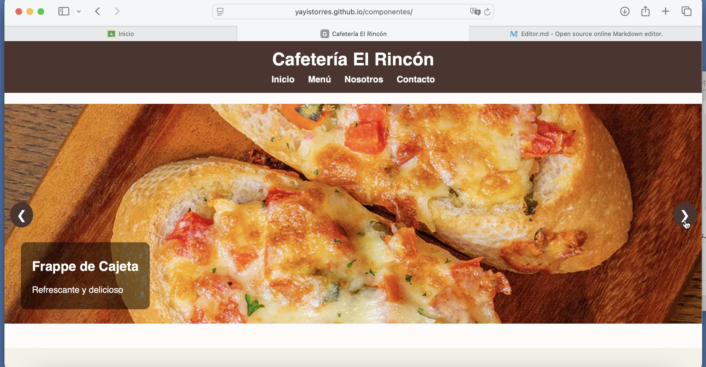
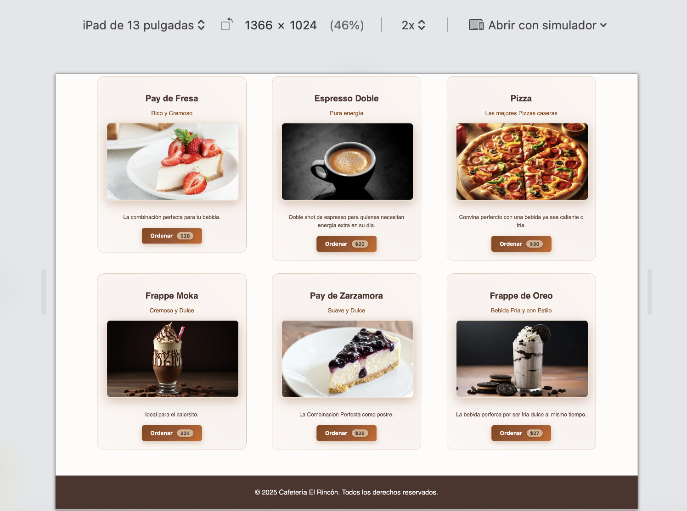
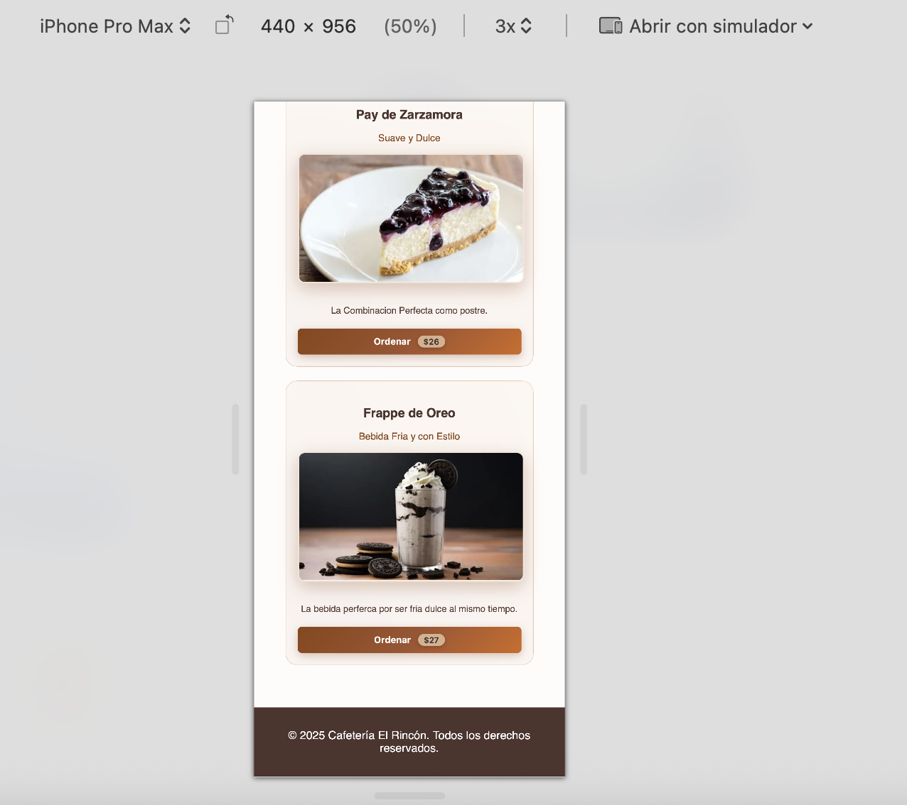

#  Cafetería El Rincón - Componente Web Interactivo



**Componente web completo para cafeterías con efectos interactivos, animaciones fluidas y diseño completamente responsivo.**

##  Demo en Vivo
[Probar ahora](https://yayistorres.github.io/componentes/)

## Características Principales
- **Carrusel inteligente** con navegación manual/automática
- **Tarjetas 3D interactivas** con efectos de movimiento al pasar el cursor
- **Contadores animados** que se activan al hacer scroll
- **Diseño 100% responsive** (móviles, tablets, escritorio)
- **Efectos visuales avanzados**: hover, gradientes animados, sombras
- **Micro-interacciones** con feedback táctil (efecto ripple)

## Capturas de Pantalla

### Vista en Diferentes Dispositivos
| Dispositivo       | Captura | Descripción |
|-------------------|---------|-------------|
| **Computadora** |  | Vista completa del componente |
| **Tablet** |  | Adaptación a pantallas medianas |
| **Móvil** |  | Versión móvil optimizada |
| **Móvil (Horizontal)** |  | Vista horizontal en smartphones |

### Detalles Interactivos
<div align="center">
  
  
</div>

##  Video
[Mirar](https://yayistorres.github.io/componentes/test.mp4)

## 🛠 Tecnologías Utilizadas


## 🛠️ Instalación

Descarga o clona desde GitHub:

```bash
git clone https://github.com/YayisTorres/componentes.git

cd componentes

## Estructura básica

componentes/
├── css/
│   ├── cards.css          # Estilos tarjetas 3D
│   ├── carrusel.css       # Estilos carrusel
│   └── counter.css        # Estilos contadores
├── img/                   # Assets visuales
├── js/
│   ├── cards.js           # Interactividad tarjetas
│   ├── carrusel.js        # Lógica carrusel
│   └── counter.js         # Animación contadores
└── index.html             # Página principal
```

## Personaizacion
En  el archivo css/cards.css 

```css
root {
  --color-primario: #8b4513;    /* Café oscuro */
  --color-secundario: #d4a574;  /* Café claro */
  --color-texto: #4e342e;       /* Texto principal */
}
```

## 🛠 Personalización de Animaciones

### Configuración Básica (counter.js)
```javascript
/**
 * Configuración principal de animaciones
 * @param {number} animationDuration - Duración total en milisegundos
 * @param {string} transitionEffect - Curva de aceleración para transiciones
 */
const animationSettings = {
  duration: 2500, // Ideal para conteos numéricos
  transition: 'all 0.3s cubic-bezier(0.68, -0.55, 0.265, 1.55)' // Efecto "rebote"
};

// Aplicar configuración a los elementos
document.querySelectorAll('.counter-number').forEach(element => {
  element.style.transition = animationSettings.transition;
  element.setAttribute('data-duration', animationSettings.duration);
});
```

### Configuración Básica (carrusel.js)

```javascript
setInterval(() => {
  slideIndex++;
  showSlide(slideIndex);
}, 5000);
```

## Futuras Mejoras

- Soporte para gestos táctiles en móviles
- Carrito de compras funcional
- Integración con API de reservas
- Modo oscuro automático

## Licencia 
MIT © Dayanira Torres Quiroz

##  Contacto

*Dayanira Torres Quiroz
torresquirozdayanira@gmail.com

*Reynaldo Roman
